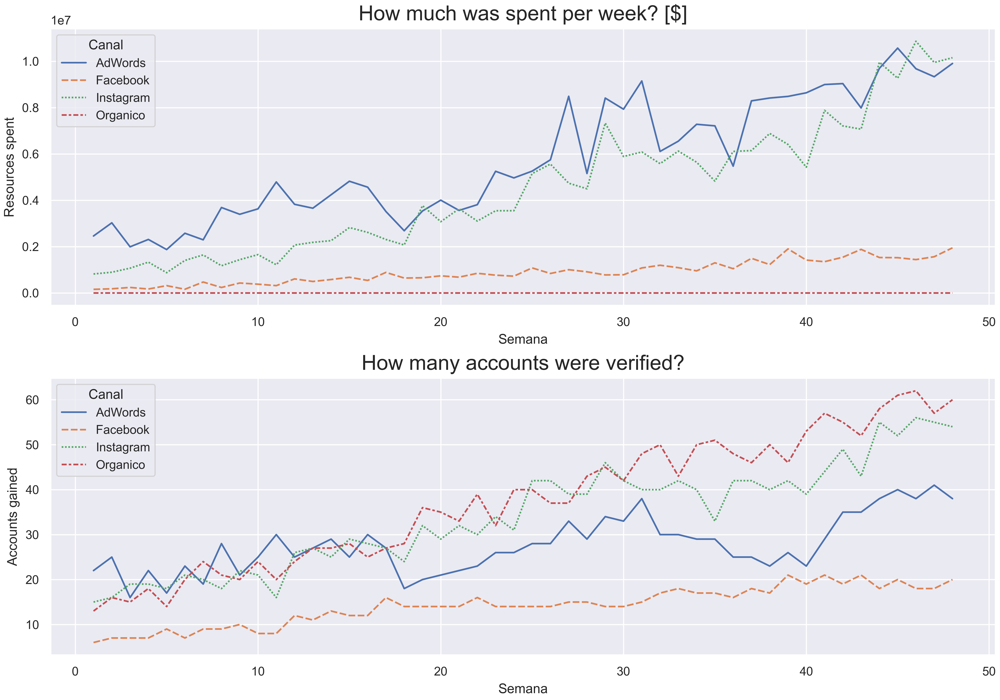
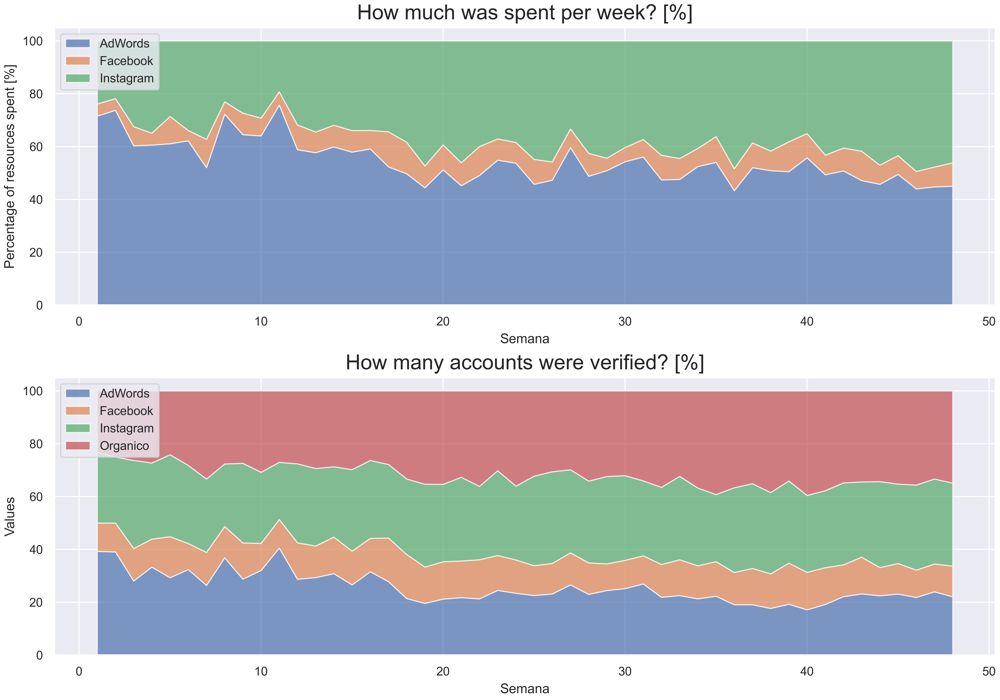
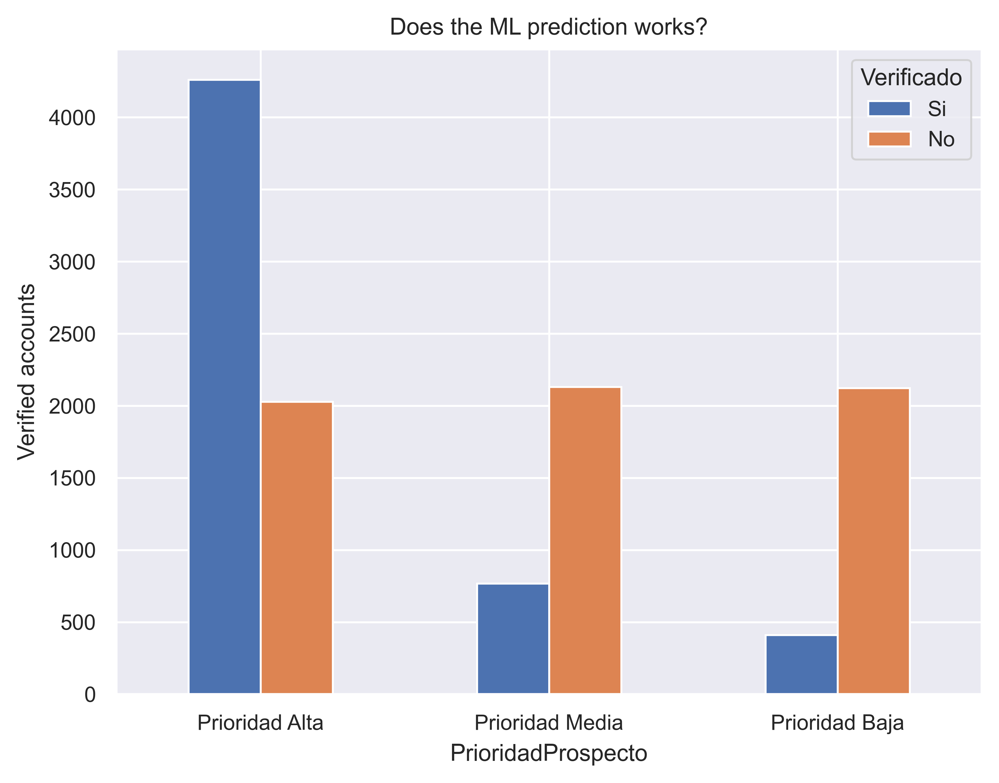
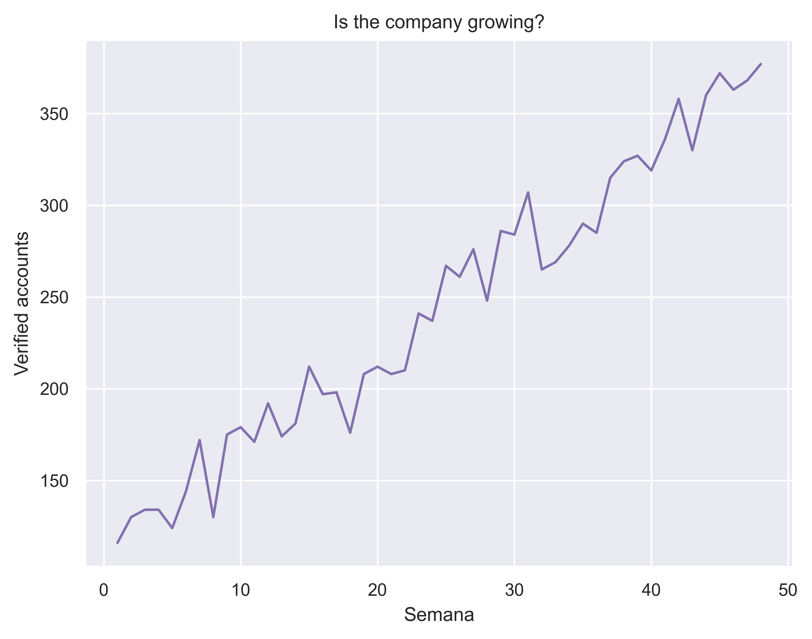

 

 
 
 
 
 
 
 
 
   

<h1 style="text-align: center;">Marketing UP Fitness</h1>
<h2 style="text-align: center;">EDA</h2>
<h3 style="text-align: center;">Eduardo Solano Jaime</h3>
<h3 style="text-align: center;">0213663</h3>
<h3 style="text-align: center;">Especialidad en Ciencia de Datos</h3>
<h3 style="text-align: center;">Universidad Panamericana Campus Guadalajara</h3>

## Objective

The objective of this report is to conduct a comprehensive analysis of the marketing strategies and performance of the fitness company by identifying potential areas of improvement, and proposing data-driven solutions to enhance marketing outcomes.

The EDA code can be consulted in the [Github repository](https://github.com/esolanoo/ProyectoTerminal_Ejercicios/tree/main/Caso1).

## The Data

The data comes directly from the company ono two separate files for operations and spendings. After data cleansing and restructuring the analysis is made from a single table constructed as follows:

| **Column name** | **Feature description** |
|----------------:| :--------------------- |
| *Semana*        | Week of the data |
| *Verificado*    | Wether the prospect gave his/her credit card info. Main key to meassure success |
| *Oe*            | Days between account created and account verification |
| *PrioridadProspecto* | Prospect priority assigned by a ML algorithm, given with the levels: *Prioridad Alta*, *Prioridad Media*, and *Prioridad Baja* |
| *Canal*         | Channel from where the client came from (*AdWords, Instagram, Facebook*, or the company's website labeled as *Organico*) |
| *Gasto*         | Amount of spending made for the specifc channel-week  from where the client came from |

## Results

### Canal (Channel)
From the following two graphs it is possible to conclude that, despite not needing any maintanance, the company's website was the biggest contributor of verified accounts (38% of them) throught the 48 weeks. It would be advisable to invest into its development and improvement to reach and maintaion a higher amount of audience.

<em>Gasto-Verificado timeseries</em>

On the contrary, the accounts gained through Facebook remain stagnant despite the increase in the marketing budget assigned to the platform. Further observation should be made to confirm this tendency in order to reasign that extra budget.

<em>Gasto-Verificado timeseries (percent)</em>

### Machine Learning 'PrioridadProspecto'

As per the next bar plot of the number of verified account for each of the categories of the prediction model used by the company, it can be determined that while the label 'Prioridad Alta' manages to accurately predict if a costumer is going to be verified, the  other two categorical labels ('Prioridad Media' and 'Prioridad Baja') behave on a very similar way, beating the purpose of them being two separate categories.

Moreover, neither of the categories help the model predict the existance of non-verified accounts ('No' label). It would be beneficial to add a 4th category to include them.

<em> ML classification results </em>

### Growth

Lastly, on a simple time comparison between the number of verified accounts through the data weeks, it can be see the clear increment of the users. Meaning the company is having a significant and stable growth despite the aforementioned issues found.

<em>Growth through time (verified accounts) </em>

